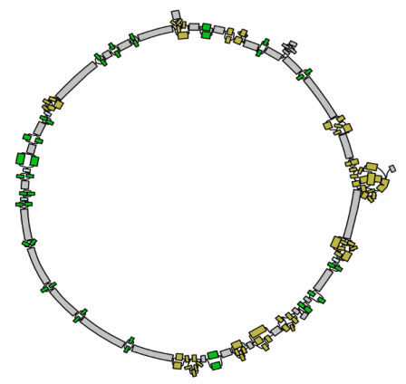
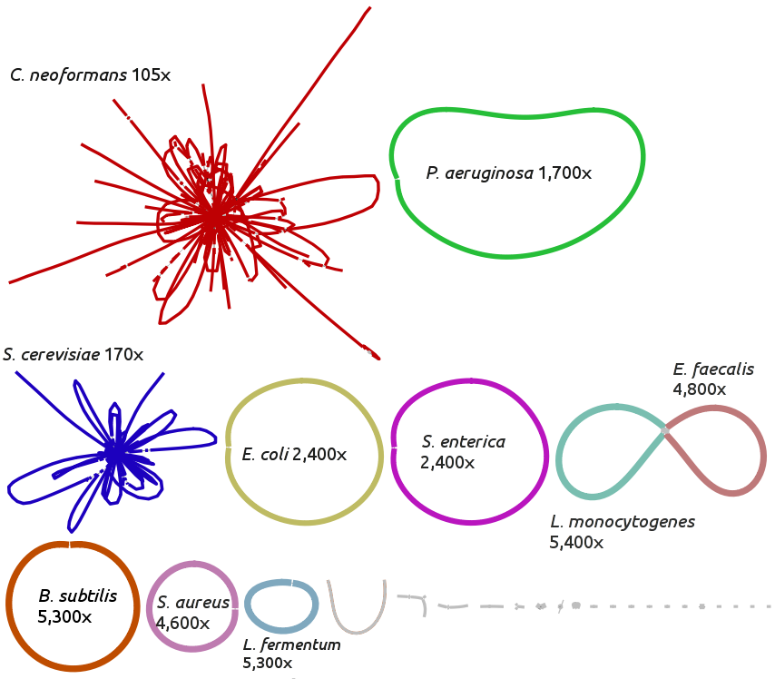
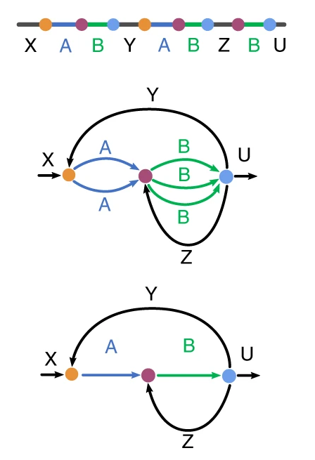
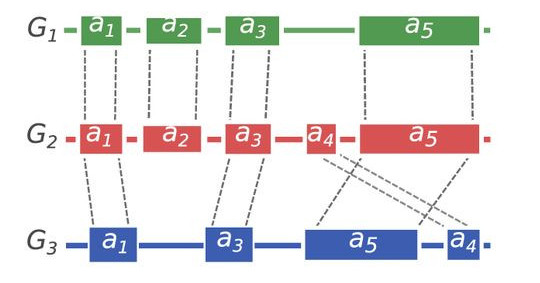
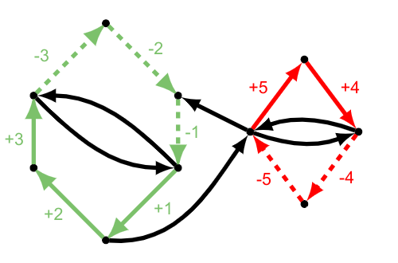

---

**Strain-level metagenome deconvolution.**
Microbial communities in many environments include distinct lineages of closely related organisms,
which have proved challenging to separate in metagenomic assembly. It is diffcult
to distinguish between read errors and real polymorphisms between bacterial strains, but
high-fidelity (HiFi) long reads have the potential to solve this issue.
[Here](https://www.biorxiv.org/content/10.1101/2021.05.04.442591v1.abstract) 
we recovered 428 complete or nearly-complete bacterial genomes from
a single sheep gut metagenomic sample, the highest resolution achieved with metagenomic deconvolution to date.
HiFi assembly has resolved many closely-related microbial lineages into distinct contigs,
proving to be a powerful tool to characterize complex heterogeneous environments.

---

**Metagenome assembly with metaFlye.** Shotgun metagenomic assembly is a powerful method to characterize
complex microbial communities (such as human gut or tumor microenvironemnts). Until recently, metagenome assemblies
based on short reads (such as Illumina) were higly fragmented and incomlete (e.g. missing 16S genes).
To enable long-read based analysis, we developed [metaFlye](https://www.nature.com/articles/s41592-020-00971-x), 
the first dedicated method for long-read metagenomic assembly. Using metaFlye we reconstructed
many complete bacterial genomes from various [metagenomic](https://github.com/PacificBiosciences/DevNet/wiki/Human_Microbiome_Project_MockB_Shotgun) 
[communities](https://github.com/LomanLab/mockcommunity).
We also showed that long-read assembly of human microbiomes enables the discovery of full-length biosynthetic
gene clusters that encode biomedically important natural products (such as Colibactin).

---

**Long-read assembly using Flye.**
The new long-read sequencing technologies (such as Pacific Biosciences or Oxford Nanopore)
increased the read length up to tens of thousands of nucleotides, and substantially improved
the quality of many genome assemblies. These technologies, however, are facing the challenge
of the high read errors. We have created the [Flye](https://github.com/fenderglass/Flye) algorithm
for assembly of long and error-prone reads to address this challenge.
Flye is using the novel [repeat graph framework](https://www.nature.com/articles/s41587-019-0072-8),
which enables fast and accurate assemblies of various organisms. In particular,
Flye is good for assembly of human genomes using ultra-long Oxford Nanopore sequencing data 
(such as [NA12878](https://github.com/nanopore-wgs-consortium/NA12878) or 
[CHM13](https://github.com/nanopore-wgs-consortium/CHM13)).

We develop the long-read assembly methods with the help of our collaborators from 
[Rob Knight's lab](https://knightlab.ucsd.edu/), 
[T2T consortium](https://sites.google.com/ucsc.edu/t2tworkinggroup), 
[Tim Smith's lab](https://www.ars.usda.gov/plains-area/clay-center-ne/marc/gbahru/people/timothy-smith/), 
[JGI](https://jgi.doe.gov/) and many others.

---

**Comparative assembly using multiple references.**
Since many de novo assemblies of large genomes are still incomplete, one
can use the information for related reference genomes to order and orient
the contig fragments. We have developed [Ragout](https://github.com/fenderglass/Ragout)
that infers structural rearrangements between the multiple input refences and 
reconstructs the most probable architecture of a target genome. 
We used Ragout to produce [chromosome assemblies](https://genome.cshlp.org/content/28/11/1720.short) 
of multiple [mice genomes](https://www.nature.com/articles/s41588-018-0223-8), 
which gave insights into rodent genome evolution and novel functional loci.
Mouse assemblies were generated as a part of 
[Mouse genomes sequencing project](https://www.sanger.ac.uk/science/data/mouse-genomes-project),
hosted by Wellcome Sanger Institute.

---

**Tools for assembly graphs analysis.** The analysis of genome graphs is helpful 
in studying repeat structure of genomes (for example, mosaic segmental 
duplications in humans). To visualize large and complex assembly graphs,
we developed [AGB](https://academic.oup.com/bioinformatics/article-abstract/35/18/3476/5306331/) - 
an interactive graph visualization [tool](https://github.com/almiheenko/AGB). 
We have also introduced a new [Synteny Paths](http://drops.dagstuhl.de/opus/volltexte/2019/11054/) 
approach for [comparison](https://github.com/epolevikov/Asgan) 
of two related genomes in a graph from, similarly
to synteny block for linear genomes. The tools were developed in a collaboration
with the [Center for Algorithmic Biotechnology](http://cab.spbu.ru/) and
[Bioinformatics Institute](https://bioinf.me/en) in St. Petersburg, Russia.

